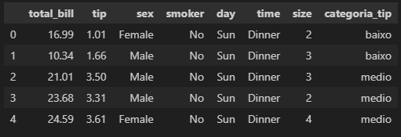
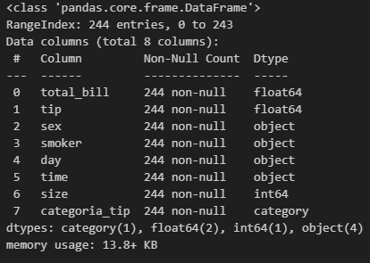
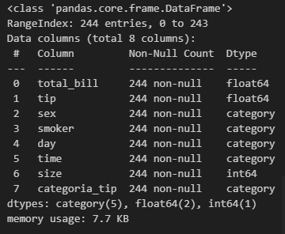
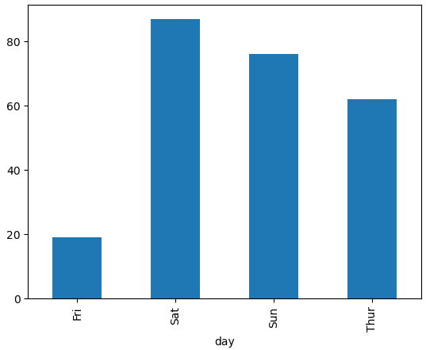
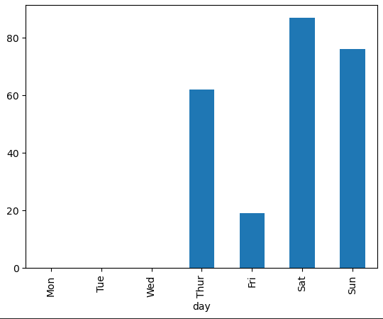
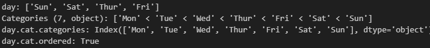

# Como criar categorias no Pandas


### Apresentação
Neste exemplo será demonstrada a criação de categorias com o pandas, bem como serão demonstrados conhecimentos básicos em plotagem de gráficos com matplotlib e análise de conjuntos de dados em DataFramas com a biblioteca Pandas:

1. Importar o pandas e fazer a leitura da base csv
2. Analisar dados da base
3. Separar valores por faixa de categoria com pandas cut
4. Transformar colunas em categoria
5. Ordenação de categorias


### Arquivos de exemplo utilizados no projeto
- [tips.csv](tips.csv)

> Se preferir, os arquivos podem ser baixados diretamente do site do [Kaggle](https://www.kaggle.com/datasets/jsphyg/tipping)

- [Download dos arquivos](https://www.kaggle.com/datasets/jsphyg/tipping)


# Configurando o ambiente:

### Passo 1
Primeiramente, faça o download do projeto:
```
git clone https://github.com/andviana/pd_categories_example.git
```

### Passo 2
Agora, entre na pasta do projeto e abra a sua IDE (os comandos abaixo abrirão o Visual Studio Code na pasta raiz do projeto)
```
cd dataframes_examples
code .
```

### Passo 3 (opcional)
Se precisar criar um ambiente virtual, no terminal, execute os comandos:
> *a criação do venv é um passo necessário no **Ubuntu 24**, bem como em outras distros linux*
```
python3 -m venv .venv
source .venv/bin/activate
```
Para desativar o ambiente virtual (venv), use o comando abaixo:
> *não execute esse comando agora, pois caso seja o venv seja desativado, problemas podem ocorrer ao tentar instalar as dependências do projeto com o* ```pip```
```
deactivate
```

### Passo 4
No terminal do seu IDE, execute a instalação do [Pandas](https://pandas.pydata.org/docs/user_guide/index.html) e do [Matplotlib](https://matplotlib.org/) conforme comandos abaixo:
```
pip install pandas
pip install matplotlib
```

# Código do Exemplo

### Separar valores por faixa de categoria com pandas cut
```
# (0,2],(2,5],(5,inf]

faixas = [0,2,5,float('inf')]
categorias = ['baixo','medio', 'alto']

df['categoria_tip'] = pd.cut(df["tip"], bins=faixas, labels=categorias)
df.head()
df.info()
```




### Criando categorias em outras colunas
```
df.columns
colunas_categoricas = ["sex", "smoker", "day", "time" ]

df_categorizado = df.copy()

for coluna in colunas_categoricas:
    df_categorizado[coluna] = df_categorizado[coluna].astype("category")

df_categorizado.head()
df_categorizado.info()
```



### Categorias ordenadas
```
df_categorizado["day"].value_counts()
df_categorizado["day"].value_counts().sort_index()
# ele automaticamente categorizou em ordem alfabetica, assim que reconheceu que é texto
```



### Corrigir ordenamento
```
df_categorizado["day"].value_counts().plot(kind='bar')
df_categorizado["day"].value_counts().sort_index().plot(kind='bar')
dias_da_semana = ['Mon','Tue','Wed','Thur','Fri','Sat','Sun']
df_categorizado["day"] = df_categorizado["day"].cat.set_categories(dias_da_semana, ordered=True)
df_categorizado.head()
```



### Considerações Finais: 
- O parâmetro ```bins``` refere-se às faixas de distribuição:
```
df['categoria_tip'] = pd.cut(df["tip"], bins=faixas, labels=categorias)
```
- A função ```cut``` do pandas gera categorias de dados
- As categorias podem ser ordenadas ou não
- Trabalhar com categorias gera economia de memória e processamento
- A ordenação da categoria pode ser alterada posteriormente a criação da mesma


### Referências
- [Biblioteca Pandas](https://pandas.pydata.org/docs/user_guide/index.html) 
- [Biblioteca Matplotlib](https://matplotlib.org/)
- [Hashtag Treinamentos](https://www.youtube.com/watch?v=yjCtRmc4D7Q)


